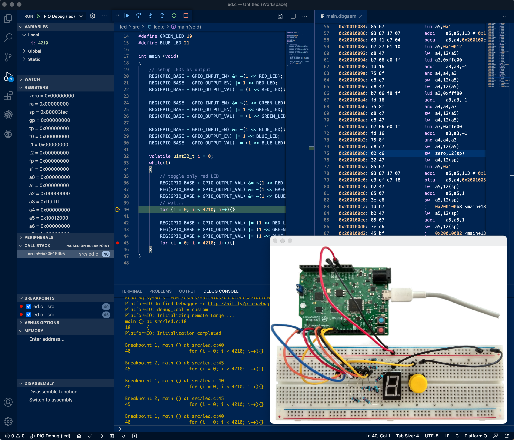

# Tools for Embedded Systems Lab Summer Term 2021

## Objective
The aim of this repository is to provide a solution for lab assignments relating to distance teaching of the embedded systems course at the Bielefeld University of Applied Sciences, Campus Minden.

For further information, please vision https://www.iot-minden.de. 

## Introduction

We use the RISC-V based virtual prototyp of AGRA Uni Bremen (https://github.com/agra-uni-bremen/riscv-vp) so that we have a virtual embedded system with breadboard. Further, we provide examples based on parts of FreeRTOS and of SiFive Freedom-E-SDK. You find the corresponding licenses of these and their examples in their directories. 

## Instruction for our toolchain
1. We require a running Linux system (though macOS would work, too). Hence, a native Linux or a Linux virtual machine has to be set up. We give no support for setting up a Linux machine. The following packages should be installed: autoconf automake autotools-dev curl libmpc-dev libmpfr-dev libgmp-dev gawk build-essential bison flex texinfo gperf libtool patchutils bc zlib1g-dev libexpat-dev libboost-iostreams-dev qt5-default

2. We use Visual Studio Code (vscode) with various extensions, namely: 

	- C/C++ IntelliSense
	- PlatformIO IDE
	- RISC-V Venus Simulator
	The following extension are useful but optional:

	- GNU Linker Map files
	- hexdump for VSCode
	- Intel HEX format
	- LinkerScript
	- RISC-V Support
	- C/C++ Advanced Lint
	
    Please install vscode with the extensions (e.g. see instructions on the vscode website).
	
3. Install the SiFive framework with the PlatformIO in vscode.
	```bash
	code
	```
	Goto Platforms on PIO Home and search for SiFive under Embedded and install. Leave vscode.


4. Clone this project with submodules (in a terminal shell, use bash). We put everything in the home directory. Adapt the following steps for another destination. 
	```bash
	cd ~
	git clone https://github.com/U2654/embedded.git
	cd embedded	
	git submodule update --init riscv-vp
	cd riscv-vp
	git submodule update --init vp/src/core/common/gdb-mc/libgdb/mpc
	```

5. Build the virtual prototyp of a embedded board with the steps:
	- riscv-vp
	```bash
	cd ../riscv-vp/vp/dependencies
	./build_systemc_233.sh
	./build_softfloat.sh
	cd ..
	mkdir build
	cd build
	cmake ..
	make install
	```
	- vp-breadboard
	```bash
	cd ../../env/redv/vp-redboard
	qmake 
	make
	```

6. Set environment variables (for bash, append to .bashrc in home).
	```bash
	export PATH=~/.platformio/packages/toolchain-riscv/bin:$PATH
	export PATH=~/embedded/riscv-vp/vp/build/bin:$PATH
	export PATH=~/embedded/riscv-vp/env/redv/vp-redboard:$PATH
	```

7. Again in the shell, check if everything works and build an example project. Start a vp-breadboard and vscode in the shell.
	```bash
	vp-redboard &
	code &
	```
	In vscode, open the folder \~/embedded/workspace/leduart and then the file leduart.c. Run the example using the gui (piodebug). 

	Open the preferences using the gui in vp-redboard. Choose the data path where config files etc. is located, this should be `~/embedded/risc-vp/env/redv/` and click ok. Open the `sevensegment.json` file. 
	Push the connect button (second from left hand side). You should see a blinking led in the vp-redboard. 
	

	
	

